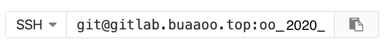
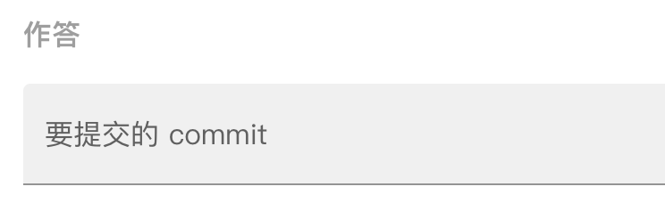
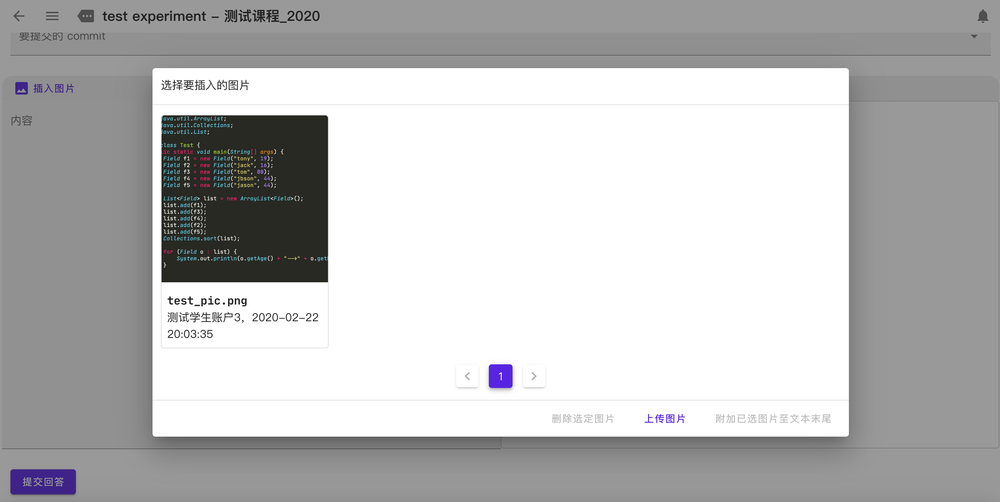
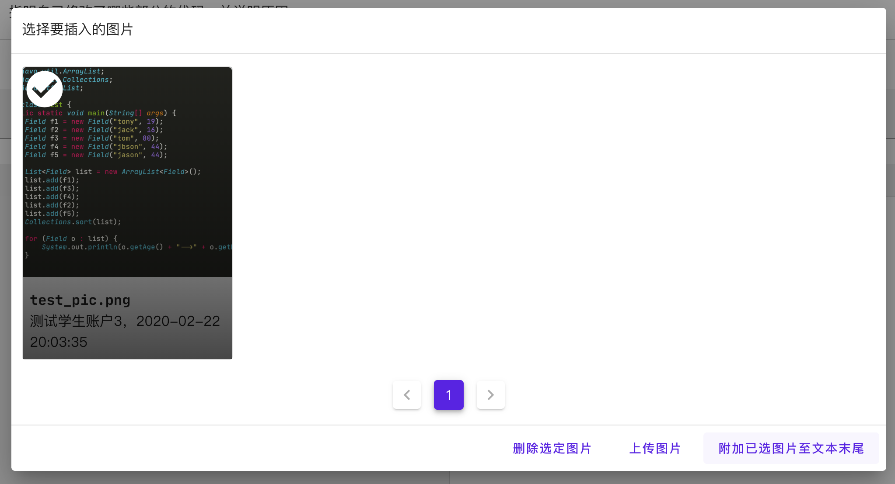
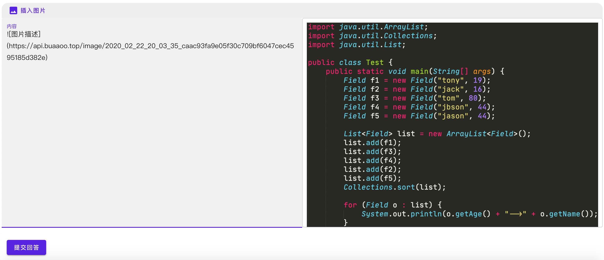

# OO课程平台使用文档

此文档演示了使用[OO课程平台](http://oo.buaa.edu.cn/)完成实验的完整流程以及使用的注意事项。为保证实验课的顺利进行，请同学们及时阅读并了解。

## 代码的提交

在实验开始之前，建议提前配置好 SSH 以节省时间，SSH 的配置已在[相关文档](https://github.com/Ailsa99/guide_book_public/blob/master/git-guide/git风格指南.md)中进行了说明。

登录课程的 GitLab，找到本次实验对应的仓库，并复制本仓库对应的 SSH URL 地址，如下图所示：



如果你没有使用 SSH，那么请选择 HTTPS，在 push 时需要输入用户名和密码。

然后在本地创建本次实验对应的文件夹，例如 `exp1`，然后打开终端 `/shell/bash` 等，进入此目录，执行：

```
git init
git remote add origin git@gitlab.oo.buaa.edu.cn:oo_2022_homeworks/xxx.git
```

然后在此工作目录中完成你的代码，当代码完成后，将其push到仓库中：

```
git add .
git commit -m "message"
git push -u origin master
```

然后，登录 OO 课程平台，在对应的实验的最下方作答区域中，点击“要提交的 commit”，从下拉列表中选择要提交的 commit，



完成其他任务后，点击最下方的“提交回答”按钮即可提交对应的代码。

## 图床的使用

在实验中会遇到需要同学们上传截图的情况，OO课程平台使用图床进行图片上传。

首先将需要上传的截图保存在本地，然后点击作答区域的 `插入图片` 按钮，然后点击 `上传图片`，选择本地图片上传，成功后你将看到如下页面：



在此之后，请务必选择要提交的图片，然后点击 `附加已选图片至文本末尾` ，将其添加到文本中。



最终的效果如下图所示：



作答区域的文本框支持 markdown 和 $\LaTeX$，希望同学们对其加以利用，按照题目要求进行适当排版后提交你的实验报告。

## 总结

实验课需要同学们提交的内容分为代码和文本两部分。按照上述操作后，最终在作答区域需要：

- 选择要提交的 commit
- 在文本框中填写实验报告（按照具体题目要求）

完成后点击 `提交回答` 按钮，提交作答。

关于实验报告，如果内容比较长，建议先在本地作答，最后将作答复制到页面中。

